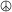

# $WhoamI

## introduction
  
 I have a lot of interests and passions, including programming and technology, music, literature, and more. I am
    extremely interested in exploring new things and want to improve myself. Not limited to:

  <ul>
    <li><strong>Coding</strong> allnight~ <code>rust / zig / lua</code> are my favourite language.</li>
    <li><strong>Archlinux</strong> User! I love ArchWiki!</li>
    <li>Github & <strong>FOSS</strong>. Free and Open is the future of world!</li>
    <li><strong>Embedded Dev</strong>. Get hand dirty is awesome!</li>
    <li><strong>Vim</strong> is everywhere to me. can't live without it.</li>
    <li>Super fans of <strong>beatles</strong> & <strong>pink floyd</strong>.</li>
    <li><strong>京アニ & Ghibli</strong>'s Animes!すく!</li>
  </ul>
  

    <a href=""><button>Clik me to know
        MORE</button></a>
  

## projects
  <li><a href="">CSAPP-Rewite</a>(Linux,C,Rust,Assembly,OS,Computer
      Organization)</li>
  <li><a href="">rust-coffee</a>(Rust,Algorithm,DataStructure,English)
  </li>
  <li><a href="">Keyboard-Story</a>(Colemak,双拼,Efficiency,Vim)</li>
  <li><a href="">Blance-Ferries</a>(Embedded,Risc-V,Rust,PID,Algorithem,SCM)
  </li>
  <li><a href="">BCI-Pillow</a>(BME,EEG,College,BCI)</li>
  <li><a href="">rust-Web</a>(HTML,CSS,JS,Rust,Network)</li>
  </b>

## my beliefs

